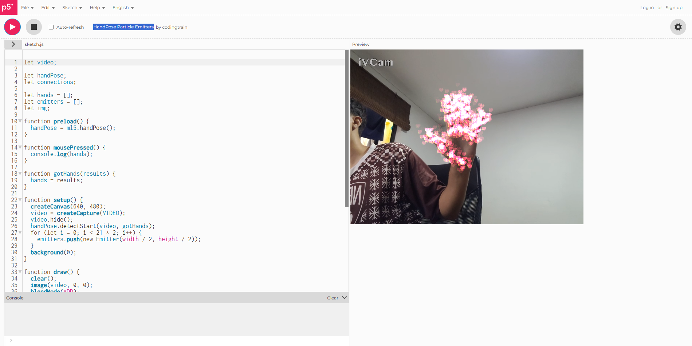

##### Ejemplo #1

HandPose Particle Emitters por codingtrain

URL : [https://editor.p5js.org/codingtrain/sketches/_HTZUBPld](https://editor.p5js.org/codingtrain/sketches/t7l5pYDDI)

Proyecto que dónde se capturan las manos del usuario para emitir particulas dependiendo de dónde esté la mano

Esto podría ser una experiencia interesante de explorar ya que podríamos hacer juegos en base a la detección de gestos de la mano, por ejemplo imagina una experiencia interactiva donde puedas manipular una interfaz sin necesidad de tocar una pantalla o un botón, un juego donde la posición de la mano sea la que controle el muñeco y dependiendo de los gestos que hagas, el personaje haga una acción diferente

##### Ejemplo #2

Drawing with Webcam Input

URL : https://editor.p5js.org/pattvira/sketches/1jhHeA9Bg

Proyecto dónde se captura la cámara y dibuja con elipses lo que se enfoque con ella.

Podríamos usar este proyecto como base para crear una experiencia donde los usuarios puedan modificar las elipses, cambiarlas de color, de tamaño y una vez estén comodos con los parámetros que escogieron puedan sacar una foto y descargarla con un código QR para que les quede un recuerdo memorable.

##### Ejemplo #3

P_2_3_6_01

URL: https://editor.p5js.org/generative-design/sketches/P_2_3_6_01

Proyecto donde se hacen conexiones en una cuadrícula dependiendo por donde pases el mouse.

Podríamos combinar esto con la detección de cámara para hacer un juego en donde tengas que conectar ciertos puntos para pasar los niveles.

