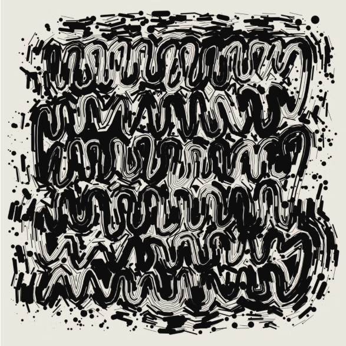
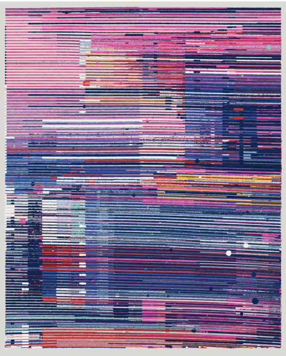

##### Tyler Hobbs

###### Biografía

Su obra se centra en la estética computacional, cómo esta es moldeada por los sesgos del hardware y software modernos, y cómo se relaciona e interactúa con el mundo natural que nos rodea. Tyler desarrolla y programa algoritmos personalizados que se utilizan para generar imágenes visuales. A menudo, estos logran un equilibrio entre la estructura fría y dura en la que las computadoras sobresalen, y el caos orgánico y desordenado que podemos observar en el mundo natural que nos rodea.

El trabajo de Hobbs ha sido exhibido internacionalmente, con recientes exposiciones individuales en Unit en Londres y en Pace Gallery en la ciudad de Nueva York. Su arte algorítmico está entre los más buscados por los coleccionistas de arte digital y ha sido incluido en numerosas subastas de casas de subastas líderes como Christie’s, Phillips y Sotheby’s. Instituciones públicas notables que poseen su obra incluyen el Museo de Arte del Condado de Los Ángeles y el Museo de Arte Moderno de San Francisco.

###### Elektroanima

Para la creación de esta obra, se inició con trazos manuales en forma de garabatos, los cuales sirvieron como base. Posteriormente, los algoritmos desarrollados por Tyler procesaron y transformaron estos trazos, modificando su estructura. El resultado es la obra que está arriba donde combina la espontaniedad del humano con el detalle y la precisión de la computación.

Las posibles influencias son el arte minimalista y caótico ya que solo se aprecia un solo color en un fondo plano con trazos aleatorios.

Esta imagen se ve que intenta simular un poco lo análogo con mediante imperfecciones en el algoritmo principal.

Quizá la influencia sean pinturas con bastante variedad de colores y formas abstractas

##### Ben Kovachs

###### Biografía

Ben Kovach es un artista visual nacido en Burlington, Vermont, que crea arte algorítmico generativo con una estética naturalista. Descubrió los beneficios del código procedural en 2017, lo que le permitió explorar rápidamente sus ideas artísticas y guardar sus elecciones estilísticas para usos futuros. Kovach ha lanzado dos colecciones de largo formato, Edifice y 100 PRINT, a través de Art Blocks y Bright Moments, respectivamente. Su objetivo es explorar el vasto espacio de resultados potenciales que permite la computación junto con el mundo.

###### Inertia

