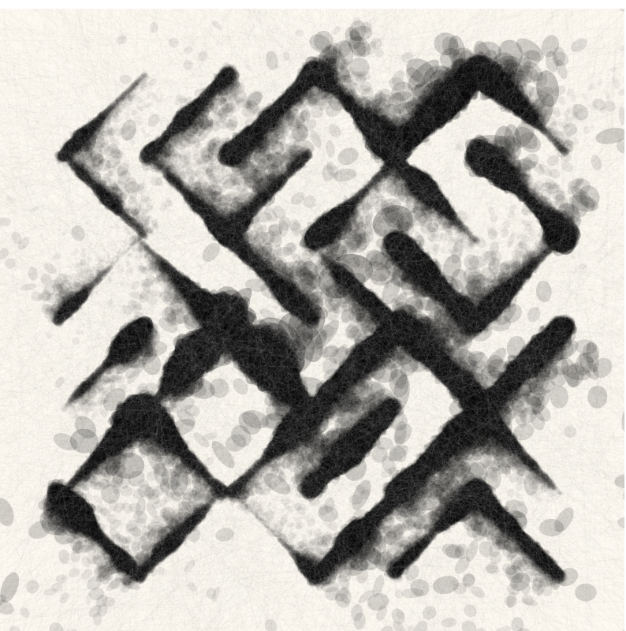
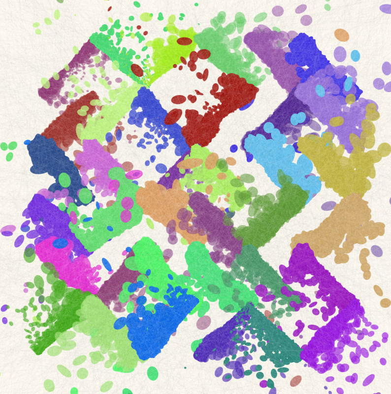

##### Ejemplo #1 

URL: https://openprocessing.org/sketch/2338928

Este código crea particulas a partir de la clase Particles, luego de crearlas las conecta con una linea creando así una cuadrícula, el codigo implementa fenónemonos físicos con el mouse al presionarlo y moverlo simulando una tela o cortina.

Las modificaciones que le hice al codigo fue simplemente cambiar algunos valores de las variables que se encargan de controlar la rigidez de la tela y el espacio que hay entre cuadro y cuadro

###### Valores originales

```js
let cloth;
let gravity;
let spacing = 20;
let cols, rows;
let stiffness = 0.28;
let damping = 0.95;  
let cutting = false;
let grabbedParticle = null;  
```

Las variables que modifiqué fueron "spacing" y "damping". La variable spacing se encarga de controlar cuanto espacio hay entre cuadros, entre más bajo sea este valor, más cuadros se van a tener que procesar.

La variable damping se encarga de controlar que tanto rebota la tela al cortarla o al moverla.


###### Ejemplo 2

URL: https://openprocessing.org/sketch/1469411

Este codigo genera un patrón artístico interesante generando lineas en sitios y angulos completamente diferentes, luego la funcion drawLineByPoint es la que se encarga de hacer que las lineas se vean distorsionadas y borrosas.



En este código quise que en vez de que las trazadas solo fueran negras, quise que cada vez que se ejecute el codigo las lineas salgan de colores completamente aleatorios, esto lo hice añadiendo variables de hue, saturation, brightness y alpha, luego hice que estas variables tomaran valores completamente aleatorios y así ya las lineas tienen colores completamente aleatorios



La función modificada quedó así:

```js
function drawLineByPoint(x1, y1, x2, y2) {
  let distance = dist(x1, y1, x2, y2);
  let angle = atan2(y2 - y1, x2 - x1);
  push();
  translate(x1, y1);
  rotate(angle);
  scale(1, random() > 0.5 ? -1 : 1);
  let d = 0;
  let dStep;
	let hue = random(360); // Matiz aleatorio (hue)
  let saturation = random(50, 100); // Saturación entre 50 y 100
  let brightness = random(50, 100); // Brillo entre 50 y 100
  let alpha = random(50, 100); 
  while (d < 1) {
    let px = lerp(x1, x2, d);
    let py = lerp(y1, y2, d);
    let n = sq(noise(d, px / 150, py / 150));
    strokeWeight((n * distance) / 2);
    stroke(hue,saturation,brightness,alpha);
    strokeCap(PROJECT);
    push();
    translate(d * distance, ((n - 1 / 2) * distance) / random(20));
    rotate(random(360));
    shearX(random(30)*(random()>0.5?-1:1));
    shearY(random(30)*(random()>0.5?-1:1));
    point(0,0);
    pop();
    // if (n < 0.25 || n > 0.75) point(px, py);
    // if (n > 0.25 || n > 0.75) point(px, py);
    d += 1 / distance / 5;
  }
  pop();
}
```


