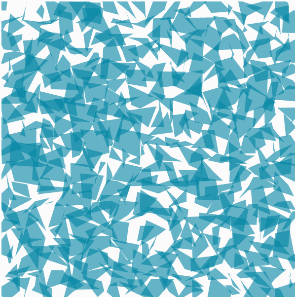
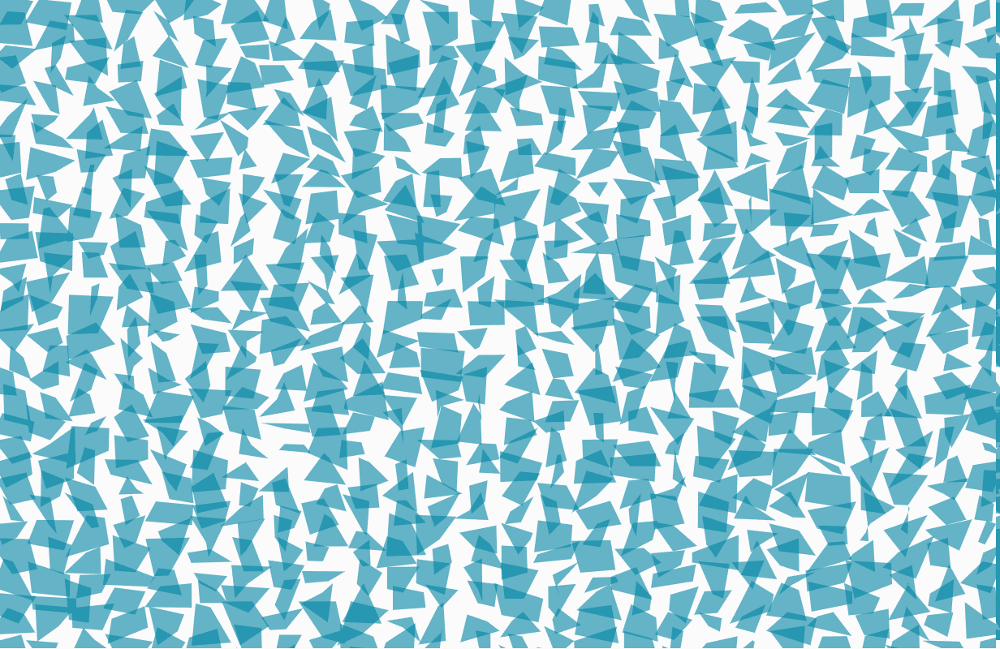
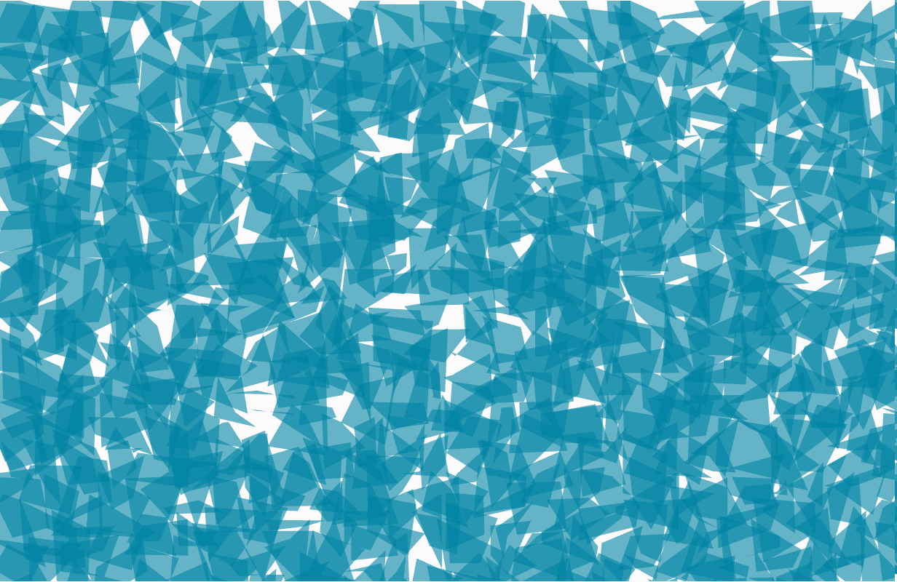
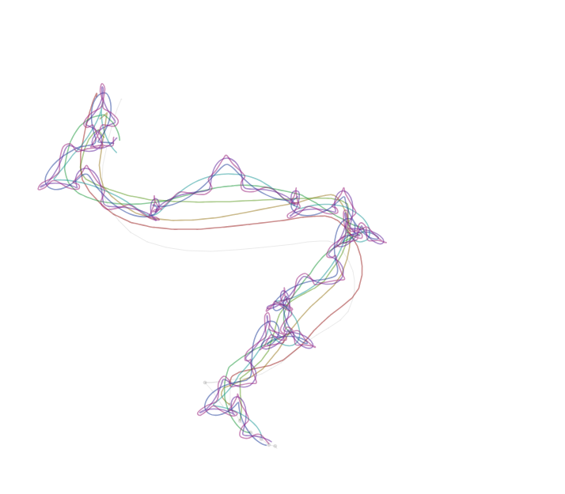
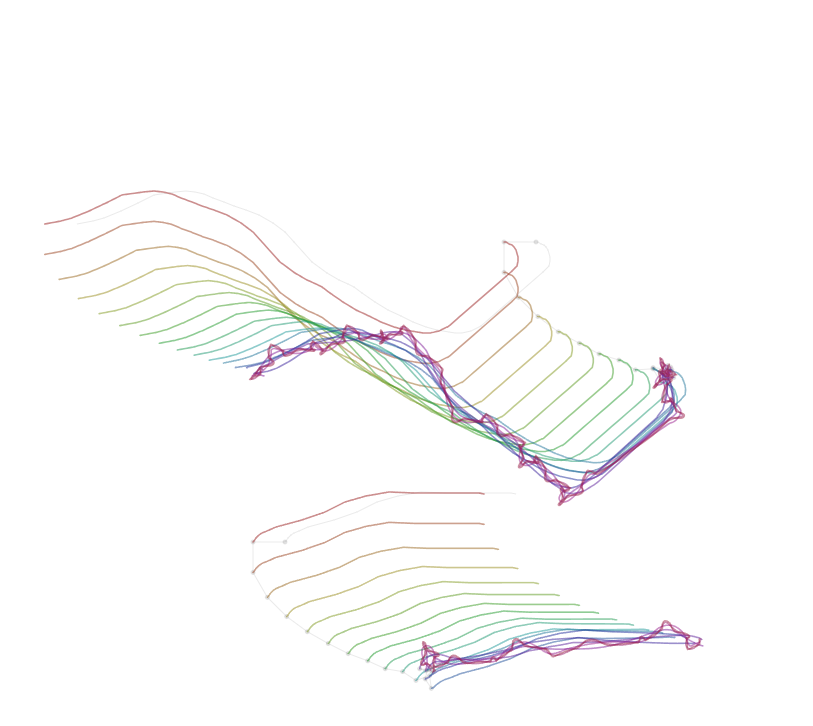

##### Ejemplo 1:

URL: https://editor.p5js.org/generative-design/sketches/P_2_1_2_04

El código se encarga de generar una cuadrícula según los parámetros dados como el tamaño de cada celda y la cantidad total de celdas, después de generarla según la posicion del mouse, cada celda modifica su forma.

La primera variación que hice fue modificar la cantidad de celdas que habrán en la cuadrícula. El valor por defecto eran 20, duplique ese valor y ahora las celdas se supoerponían y las deformaciones no se apreciaban bien, para solucionar eso, tuve que cambiar el tamaño del canvas para que las celdas no se pisen unas con otras.

La segunda variación que hice la hice sobre la primera, cambié el tamaño de cada celda para que no quedaran espacios en blanco. El valor original estaba en 30, lo cambie a 50.

Las posibles aplicaciones que le veo a este programa es la creación de puzzles interactivos en dónde por ejemplo tengas que construir una con la ayuda de un sensor que capte el movimiento de tus ojos y así dar la impresión de que estás moviendo la imagen con tu mente

##### Ejemplo 2: 

URL: https://editor.p5js.org/generative-design/sketches/P_2_2_6_02

El código se encarga de generar trazos al rededor del recorrido que haya hecho el mouse con el click presionado, la cantidad de trazos varia segun la cantidad de joints que le hayas puesto.

La primera variación que le hice fue modificar la velocidad a la que se hacen los trazos.

La segunda variación que le hice al código fue modificar la cantidad de joints que se generan cada vez que se dibuja algo en la pantalla

Esta aplicacion se podría modificar para generar piezas artísticas únicas también usando diferentes tipos de sensores como acelerometros

